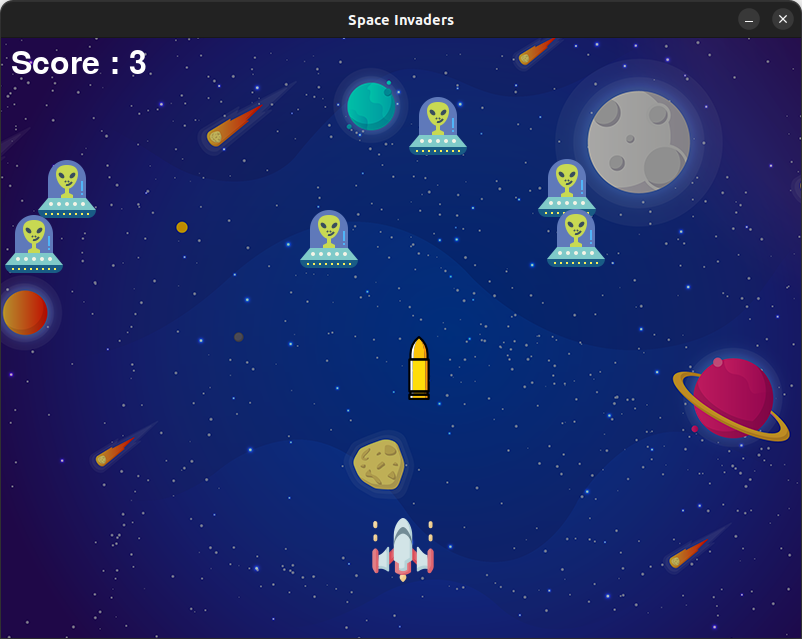
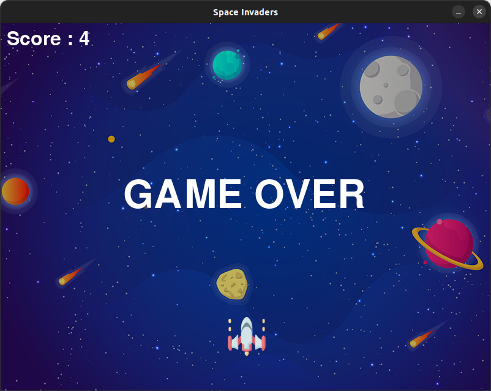

# Space Invaders

Space Invaders is a classic arcade-style shooter game developed in Python using the Pygame library. The objective is simple: navigate your spaceship, shoot down aliens, and avoid letting any enemies reach the bottom of the screen. Accumulate as many points as possible before you lose!

## Table of Contents
- [Features](#features)
- [Installation](#installation)
- [How to Play](#how-to-play)
- [Game Mechanics](#game-mechanics)
- [Gameplay](#gameplay)
- [Credits](#credits)
- [License](#license)

## Features
- **Classic Arcade Gameplay**: Relive the retro arcade experience with classic space shooter mechanics.
- **Enemy Waves**: Face waves of enemies that increase in difficulty over time.
- **Scoring System**: Keep track of your score to challenge your best record.
- **Game Over Screen**: A visual display appears when the game ends.
- **Sound Effects and Background Music**: Enhance the experience with laser sounds, explosions, and background music.

## Installation

1. **Clone the repository:**
   ```bash
   git clone https://github.com/mohammedrashithkp/SpaceInvaders.git &&
   cd SpaceInvaders 
   ```
2. **Install the required dependencies:**
   ```bash
   pip install -r requirements.txt
   ```
3. **Run the game:**
   ```bash
   python spaceInvaders.py
   ```


## How to Play
- Use the **Arrow keys** to move your spaceship up, down, left, and right.
- Press **SPACEBAR** to shoot bullets at approaching enemies.
- Destroy all enemies to increase your score.
- Avoid letting any enemies reach the bottom of the screen—if they do, the game is over.

## Gameplay




## Game Mechanics

### Player
- The player controls a spaceship that can move in four directions.
- Shooting is only available when there is no active bullet on screen, adding a layer of strategy to timing your shots.

### Enemies
- Multiple enemies move across the screen and drop down periodically.
- Each enemy hit by the player’s bullet awards points.
- If an enemy reaches the player’s level, the game ends.

### Scoring
- A score counter displays at the top left of the screen, showing the player’s current score.

### Collision Detection
- Collision detection is calculated based on the distance between bullets and enemies. When an enemy is hit, the player is awarded points, and the enemy resets to a random position.

 

## Credits

- [Ufo icons](https://www.flaticon.com/free-icons/ufo) created by [smalllikeart](https://www.flaticon.com/authors/smalllikeart) - Flaticon
- [Alien icons](https://www.flaticon.com/free-icons/alien) created by [Pixel Buddha](https://www.flaticon.com/authors/pixel-buddha) - Flaticon
- [Spaceship icons](https://www.flaticon.com/free-icons/spaceship) created by [Freepik](https://www.flaticon.com/authors/freepik) - Flaticon
- [Bullet icons](https://www.flaticon.com/free-icons/bullet) created by [Smashicons](https://www.flaticon.com/authors/smashicons) - Flaticon

## License
This project is licensed under the MIT License. See the [LICENSE](LICENSE) file for details.

